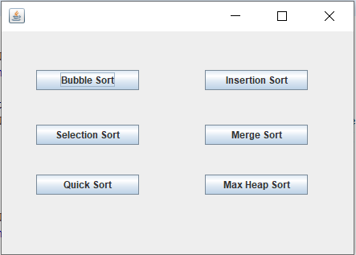
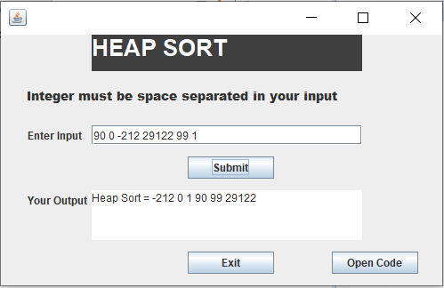

# GUI-based-Algorithm-Calculator
Java Graphical User Interface  application which contain 6 type of sorting algorithms. 

# 1.	Abstract:		
Algorithm calculator is a graphical user interface application   software. Where user can compute the sorting operations on any integer array and get instant answer. This could be time saving for student and faculty while learning and teaching the algorithms.

# 2.	Introduction:
Algorithm calculator is GUI based application developed using JAVA programming language and its supportive packages for GUI support. In this application there are two frames. First frame is main menu and it contains 6 different type of sorting algorithms’ button. When user click on anyone button it open next frame which contain input text area, submit button, output text area and open code button. By entering proper input when user submit it, the output text area get output string which describes sorted integer array of given integer input. “Open Code” button opens the text file which contain source code of particular sorting algorithm.
	To complete this mini project many java features and many sorting algorithms are used as a part of learning process. Those are as follows:

      1.	Java Swing (Graphical User Interface widget toolkit for java)
      2.	Java AWT (Abstract Window Toolkit)
      3.	Exception handling 
      4.	Java Process builder class(Used to create operating system process)
      5.	Bubble sort
      6.	Insertion sort
      7.	Merge sort
      8.	Quick sort
      9.	Heap sort
      10.	Selection sort

# 3.	Procedure and Background:

Different classes and interfaces of java used in this project are as follows:

      1.	java.awt.EventQueue;
      2.	javax.swing.JFrame;
      3.	javax.swing.JButton;
      4.	java.awt.event.ActionListener;
      5.	java.awt.event.ActionEvent;
      6.	javax.swing.JTextField;
      7.	javax.swing.JLabel;
      8.	java.awt.event.ActionListener;
      9.	java.awt.event.ActionEvent;
      10.	javax.swing.JTextArea;
      11.	java.awt.Font;
      12.	java.lang.ProcessBuilder

In background , when user click on any one of the 6 buttons we have called on function
that set visibility of next frame ‘true’ and closes the current frame by setting visibility of current frame ‘false’. When user click on ‘Open Code’ jButton it will create one process builder object and open selected text file in notepade.

When user click on any one of the button in main frame, they all have one separate key that describes its information to next frame. In next frame as per their key , sorting algorithm will be executed after user give input to input area and click submit button. Sorted integer array will be display in output area. 

# 4.	Snapshots of running application

a. MAIN FRAME

 

b. SECOND FRAME DO SORTING OF INPUT ARRAY
 

# 5.	Conclusion:

By implementing this project, we learned how to make graphical user interface based application software using java swing. We also used core concepts of java like inheritance , exception handling, process builder class. Projects like this helps us to develop our problem-solving skills by which we can also compete with others to stand out from the crowd.

# 6.	References:

_1. The Complete Reference JAVA Seventh edition.
2. https://www.javatpoint.com/java-swing
3. https://www.geeksforgeeks.org_ 

